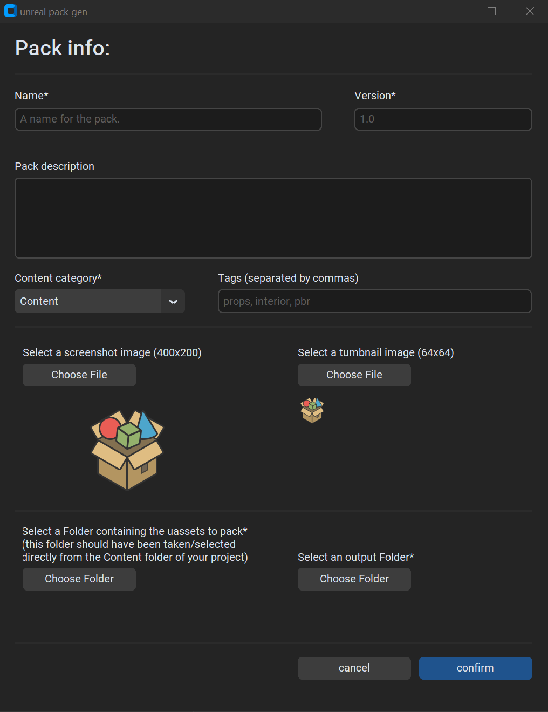

# unreal pack gen
A python tool for generating content packs for UE 5

Uses  the [CustomTkinter](https://github.com/TomSchimansky/CustomTkinter) library for UI

## Features
current features:
- automatic generation of .upack file
- output options:
  - zipped pack (content + .upack)
  - unpacked file structure ( +.bat file for easy packing)
  - installing pack directly to engine
- UI:
  - scaleable
  - support for light/dark themes  

TODO:
- UI:
  - support for high contrast
  - support for keyboard navigation
  - support for screen reader
  - other accessibilty features
- options for adding C++ classes to pack
- loading info from unpacked file structure/.upacks
- validation step after geneation
- support for other platforms  

## Setup
Requires:
- Python 3.7 or greater
- unreal engine 5.0 or older to be installed  
Designed exclusively for Windows 10+

install steps:
- download or clone this repository
- install dependencies:  
  ```pip3 install -r requirements.txt```
- (optional) add any extra files you want added to your packs into ```settings\packAdditions\``` (ex: README)
- run ```unrealPackGen.py```  

NOTE: see ```unrealPackGen.py``` for optional command line args  

## Gallery


## License
[MIT](./LICENSE)